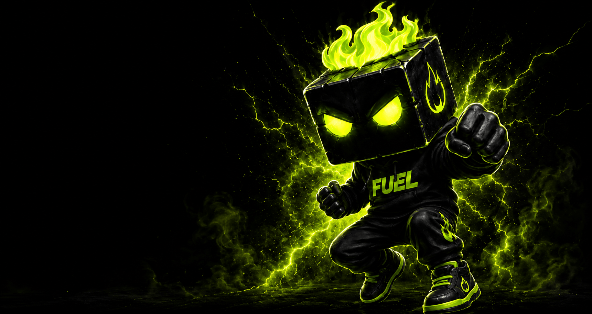
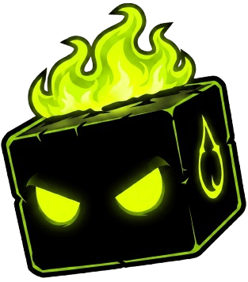
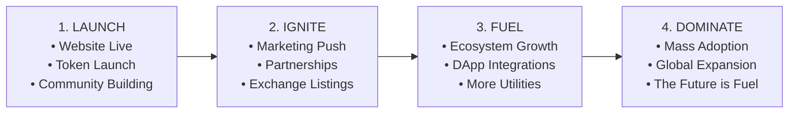

# $BLKFUEL — Fueling the Onchain Economy ⚡

<p align="center">
  
</p>

<p align="center">
  <strong>The official community token fueling the next generation of onchain innovation on the Robinhood Chain.</strong><br>
  Built for builders, traders, degens &amp; believers. <em>Every block needs fuel.</em>
</p>

<p align="center">
  <a href="https://blockfuel.netlify.app"></a>
  <a href="https://x.com/4blockfuel"></a>
  <a href="https://t.me/+MR2aUw2u1qBiYzgx"></a>
  <a href="https://dexscreener.com"></a>
</p>

---

## 🌟 Overview

**$BLKFUEL** is a next-generation onchain cryptocurrency designed to power decentralization, liquidity, and trading on the **Robinhood Chain**.

- 🚀 **Zero Tax**: 0% buy/sell fees for unrestricted trading and liquidity flow.
- 🔒 **Liquidity Locked & Contract Renounced**: 100% SAFE community-first architecture.
- ⚡ **Robinhood Chain Native**: Fast finality and low-cost onchain transactions.

---

## 🪙 Tokenomics

<p align="center">
  
</p>

### Key Metrics

| Metric | Details |
| :--- | :--- |
| **Token Name** | BLKFUEL |
| **Ticker** | `$BLKFUEL` |
| **Network** | Robinhood Chain |
| **Total Supply** | `1,000,000,000` (1 Billion) |
| **Buy / Sell Tax** | `0%` |
| **Contract Status** | Renounced |
| **Liquidity** | 100% Locked |

### Distribution

```
┌────────────────────────────────────────────────────────┐
│  🟢 40% Liquidity Pool (Locked)                        │
│  🟢 20% Marketing & Growth                             │
│  🔘 20% Community Ecosystem & Rewards                  │
│  🔘 10% Core Team & Development                        │
│  🔘 10% CEX & Strategic Listings                       │
└────────────────────────────────────────────────────────┘
```

---

## 🗺️ Roadmap



---

## 🛠️ Technical Stack & Architecture

This landing platform is built using modern, production-grade web technologies adhering to Awwwards-tier UI/UX standards:

- **Framework**: [Next.js 16 (App Router + Turbopack)](https://nextjs.org/)
- **Core Library**: [React 19](https://react.dev/)
- **Styling**: [Tailwind CSS v4](https://tailwindcss.com/)
- **Motion & Interactions**:
  - [Framer Motion](https://www.framer.com/motion/) — Declarative bidirectional scroll & entry animations
  - [Lenis](https://github.com/darkroomengineering/lenis) — Ultra-smooth momentum scrolling
  - [GSAP](https://greensock.com/gsap/) — High-performance animation sequencing
- **Iconography**: [Lucide React](https://lucide.dev/) & [Google Material Icons (`react-icons/md`)](https://react-icons.github.io/react-icons/icons/md/)
- **Notifications**: [Sonner](https://sonner.emilkowal.ski/)
- **Custom Typography**: Morton & Frygia custom display typefaces

---

## 🎨 Interactive & Visual Features

1. **Interactive Ambient Green Glow**: Dynamic, mouse-tracking aurora with continuous organic trailing interpolation.
2. **60FPS Real-Time Dashed Connectors**: Real-time Javascript `requestAnimationFrame` render loop powering glowing SVG dashed lines across roadmap phases.
3. **Magnetic Micro-Interactions**: Physics-based magnetic pull on interactive buttons, cards, and social icons.
4. **Comprehensive SEO & Rich Snippets**: Schema.org JSON-LD structured data (`Organization`, `WebSite`, `WebPage`), OpenGraph 1200x630 sharing banners, automated `sitemap.xml`, and `robots.txt`.
5. **Responsive Layouts**: Multi-breakpoint testing across mobile, tablet, and widescreen desktop displays.

---

## 📁 Repository Structure

```text
boxfeul/
├── app/
│   ├── globals.css           # Design tokens, keyframe animations, & Tailwind v4 layers
│   ├── layout.tsx            # Metadata, OpenGraph, JSON-LD Schema, & Root Layout
│   ├── page.tsx              # Assembled landing page sections
│   ├── robots.ts             # Search engine robots.txt generator
│   └── sitemap.ts            # Dynamic XML sitemap generator
├── components/
│   ├── navbar.tsx            # Sticky glassmorphism header with mobile drawer
│   ├── hero-section.tsx      # Main hero with Robinhood badge & buy triggers
│   ├── token-stats-bar.tsx   # Key metric counters with glowing accents
│   ├── about-section.tsx     # Mission story, mascot, & feature bento card
│   ├── tokenomics-section.tsx# Donut chart & security guarantee cards
│   ├── roadmap-section.tsx   # 4-stage timeline with 60fps flowing dashed lines
│   ├── how-to-buy-section.tsx# Step-by-step Robinhood Chain onboarding guide
│   ├── footer.tsx            # Large anchored mascot CTA banner & nav links
│   ├── ambient-glow-background.tsx # Interactive cursor-follow aurora glow
│   ├── smooth-scroll.tsx     # Lenis smooth scroll provider
│   └── magnetic.tsx          # Spring physics magnetic attraction wrapper
├── lib/
│   ├── fonts.ts              # Local font optimization (Morton & Frygia)
│   └── utils.ts              # Class name merging utilities
└── public/
    ├── about.png             # About character mascot
    ├── face.png              # Fiery cube face (Favicon & mascot logo)
    ├── hero-bg.png           # Desktop character background & social banner
    ├── hero-bg-mobile.png    # Optimized mobile character background
    ├── robinhood_chain*.png  # Robinhood Chain official badge
    ├── social.png            # Thumbs-up mascot illustration
    └── manifest.json         # PWA Web App Manifest
```

---

## 🚀 Getting Started

### Prerequisites

- [Node.js](https://nodejs.org/) (version 18.18 or higher)
- [npm](https://www.npmjs.com/)

### Installation

1. Clone the repository:
   ```bash
   git clone https://github.com/ayanmal1k/BLKFUEL.git
   cd BLKFUEL
   ```

2. Install dependencies:
   ```bash
   npm install
   ```

3. Start the local development server:
   ```bash
   npm run dev
   ```

4. Open [http://localhost:3000](http://localhost:3000) in your browser.

### Production Build

To test and compile the production bundle:

```bash
npm run build
npm run start
```

---

## 🔗 Official Channels

- 🌐 **Website**: [https://blockfuel.netlify.app](https://blockfuel.netlify.app)
- 🐦 **X (Twitter)**: [@4blockfuel](https://x.com/4blockfuel)
- 💬 **Telegram Community**: [Join $BLKFUEL Telegram](https://t.me/+MR2aUw2u1qBiYzgx)
- 📊 **Dexscreener**: [View Live Charts](https://dexscreener.com)

---

## ⚠️ Disclaimer

*$BLKFUEL is a decentralized cryptocurrency and community utility token. Cryptocurrency trading carries risk. Always do your own research (DYOR) and trade responsibly.*
